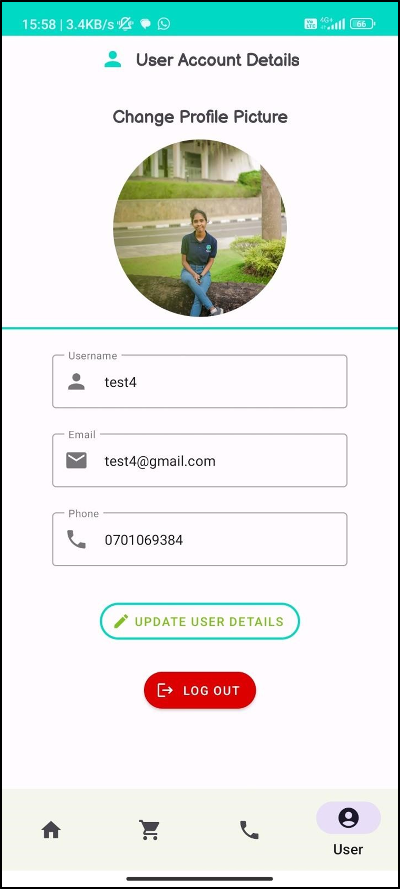

# Plant Disease Classifier Mobile Application


## Table of Contents

- [About the Project](#about-the-project)
- [Built With](#built-with)
- [Getting Started](#getting-started)
  - [Prerequisites](#prerequisites)
  - [Installation](#installation)
- [Contributors](#contributors)
- [License](#license)
- [Acknowledgements](#acknowledgements)

## About the Project

Like humans, plants also get diseases. There are many methods in the world to identify diseases. This is also a solution for that. It's a plant disease classifier. The outcome of the project is to identify diseases of the plants. (Leaves, trunk, bark, root, branches) We hope to develop a mobile application for any user who knows or doesn't know about diseases to identify them from 
anywhere in the world quickly. If we can identify the plant disease in the beginning before it causes significant damage to the plant, it will be the most critical point in this whole process. <br>
Plants are the primary source of food for humans and animals. However, plant diseases can 
significantly reduce crop yield and quality, resulting in economic losses and food shortages. The 
early detection and diagnosis of plant diseases are critical for controlling the spread of diseases 
and minimizing crop losses. Traditional methods of disease diagnosis rely on visual inspection by 
trained experts, which can be time-consuming and expensive. Therefore, the development of 
automated plant disease detection systems has gained increasing attention in recent years.<br>
Target users 
- Professionalises in Agri Culture Field (Agents) 
- Farmers 
- Citizens / People 
- Shop owners <br><br>


## Built With

- [Java](https://www.java.com/en/)
- [Android Studio](https://developer.android.com/studio)
- [Firebase](https://firebase.google.com/)
- [TensorFlow](https://www.tensorflow.org/)
- [Python](https://www.python.org/)
- [Keras](https://keras.io/)
- [Google Colab](https://colab.research.google.com/)
- [Google Cloud Platform](https://cloud.google.com/)
- [Google Drive](https://www.google.com/drive/)

## Getting Started

### Prerequisites

- [Android Studio](https://developer.android.com/studio)
- [Python](https://www.python.org/)
- [Google Colab](https://colab.research.google.com/)
- [Google Cloud Platform](https://cloud.google.com/)
- [Google Drive](https://www.google.com/drive/)
- [Firebase](https://firebase.google.com/)
- [TensorFlow](https://www.tensorflow.org/)
- [Keras](https://keras.io/)
- [Java](https://www.java.com/en/)
- [Git](https://git-scm.com/)

### Installation

1. Clone the repo
```sh
git clone https://github.com/ravindu0823/Computing-Group-Project.git
```
2. Open the project in Android Studio
3. Run the project

## Contributors

- [Ravindu Dhanushka](https://github.com/ravindu0823)
- [Sakya Rasadi](https://github.com/sakyarasadi)
- [Nirodha Fernando](https://github.com/AngelNirodha)


## Acknowledgements

- [GitHub Pages](https://pages.github.com)
- [GitHub Readme Template]()
- [TensorFlow](https://www.tensorflow.org/)
- [Keras](https://keras.io/)
- [Google Colab](https://colab.research.google.com/)

## Usage
### Loading


### Login


### Register


### Home


### Profile


### Contact


### Scan Image


### Result


### Shops


### Treatment


